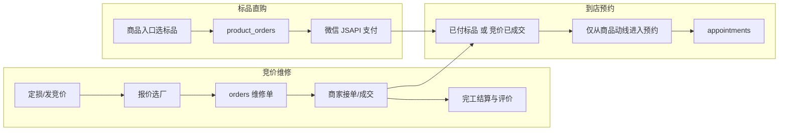
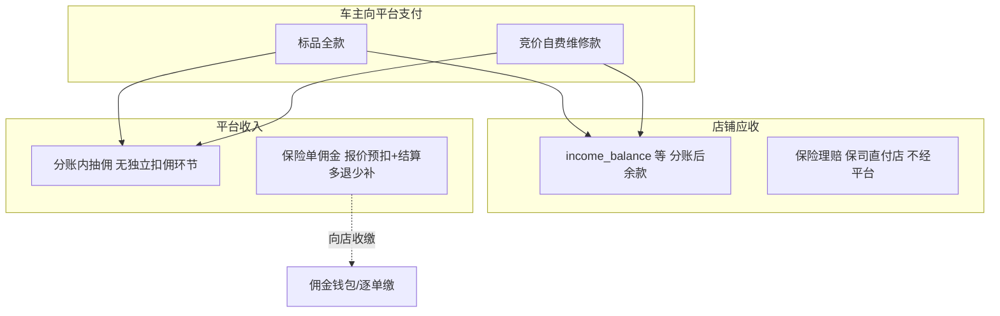

# 支付与结算总览

> **定位**：从产品经理视角归纳辙见三条产品线（标品直购、竞价维修、到店预约）与两条资金线（车主/平台收款、平台佣金与店铺货款结算），对照目标架构标注差距与演进方向。  
> **依据**：以当前仓库实现为准（`web/api-server/services/`、`web/database/schema.sql`），不臆造未实现的支付或保司接口。文中 **「产品约定」** 为已确认的业务口径，若与线上入口或配置不一致，以实现改造或配置对齐为准。

---

## 一、三条产品线（用户侧）

**时点区分（避免混淆）**：竞价侧 **商家接单即视为成交，用户即可预约到店**；**不要求**在接单时按报价付清维修款。**维修价款**（自费经平台、或保险理赔到店）均在 **服务完工、并以结算单确定金额后** 再支付或对账；`quoted_amount` 仅为议价参考。

### 产品线矩阵

| 产品线 | 代表数据 / 入口 | 与支付关系（当前实现） |
|--------|-----------------|------------------------|
| **标品直购** | `product_orders`；`product-order-service.js`（`createPrepay` 等） | 车主在小程序内对**订单全额**走微信 JSAPI；回调入账后，平台按配置的 `product_order_platform_fee_rate`（见 `shop-income-service.js`）抽成，余款记入店铺 **`income_balance`**（货款账本），可走微信零钱/对公提现（已实现）。 |
| **竞价维修** | `biddings` → `orders`；`bidding-service.js`（如 `selectQuote`） | **产品约定**：**商家接单后订单即视为成交**，此时用户即可发起预约。竞价**报价未必等于最终成交价**，**维修价款以完工后的实际结算为准**。**资金流**：**自费**车主 → 平台 → 服务商，**佣金在支付分账中一次完成**（第四节模式一）；**保险**保司 → 服务商，平台**不触达理赔款**，**佣金按报价预扣、按结算多退少补**（第四节模式二）。**当前实现（仓库）**：**自费**在商户提交结算后，车主可 `POST /api/v1/user/orders/:id/repair-prepay` 微信 JSAPI 支付，回调 `repair-order-notify` 经 `shop-income-service.settlePaidRepairOrder` 分账入 `income_balance`；**仅保险单**（`is_insurance_accident`）完工走 `commission-wallet-service` 阶段 A/B。 |
| **到店预约** | `appointments`；`appointment-service.js`；小程序预约页（如 `pages/shop/book`） | **产品约定**：**仅允许已购买或已成交的用户预约**——标品须已完成 `product_orders` 支付；竞价须 **商家已接单**。**预约入口从商品/订单链路进入**；店铺详情「立即预约」仅说明，不直达表单。**当前实现**：创建预约须传 `product_order_id` 或 `order_id` 之一并由服务端校验；表字段 `appointments.product_order_id` / `order_id` 记录关联。 |

---

## 二、支付线 / 资金线（平台视角）

拆成 **「谁付钱」** 与 **「谁给平台佣金」**；当前实现**并非**统一的「车主维修款全额进平台再分账」。

### 维修价款 vs 平台佣金（产品约定）

- **支付时点（维修价款）**：**自费与保险均在服务完成后**，按最终结算金额收款或对账；竞价 `quoted_amount` 仅作参考。  
- **分支一 — 车主支付给平台的订单**（含 **标品**、以及目标态下 **竞价自费维修款** 经平台）：车主付款进入平台商户号后，**在同一笔支付/分账中直接扣除平台佣金，余款结算给服务商**，**不再单独设置一层「向店扣佣」流程**（与标品 `product_order` 入账逻辑同类：抽成 + 余款入店）。  
- **分支二 — 维修款不经过平台的订单**（**保险理赔**：保司直接付服务商）：平台**无法从理赔款里拆账**，故平台佣金**不通过「车主支付分账」收取**，而采用：**按报价预扣（暂计）佣金 → 按最终结算金额多退少补**（见第四节模式二，对应现有 `commission-wallet-service` 阶段 A/B）。  
- **账务防重**：同一笔订单**不得**既在「车主支付分账」里扣过平台佣金，又对同一单再走一遍佣金钱包的预扣/补缴；**二选一**由「钱是否进平台」决定（细则见附录 A **A.7**）。

### 资金线矩阵

| 资金类型 | 当前主要路径 | 说明 |
|----------|--------------|------|
| **标品货款** | 微信 → 平台商户号 → 按比例拆分 → `merchant_commission_wallets.income_balance` + `merchant_shop_income_ledger`（`shop-income-service.js`） | **车主付平台**：支付回调内 **分账即含平台抽成**，**无**单独「向店扣佣」环节；与维修 **佣金钱包 `balance`** 分字段。 |
| **竞价自费维修款（车主付平台）** | `repair-order-payment-service.js`；`POST /api/v1/user/orders/:id/repair-prepay`；`POST /api/v1/pay/wechat/repair-order-notify`；`repair_order_payment_intents`；`orders.repair_payment_*` | 与标品同类：**一次支付、分账留佣、余款入店**（`merchant_shop_income_ledger` 类型 `repair_order_settle`）；**不**对该单再走 `commission-wallet` 重复扣佣。详见 [附录 A](#附录-a-prd-摘要维修自费-orders-微信全额支付)。 |
| **保险单平台佣金（不经平台收维修款）** | `commission_provisional` / `commission_final` + `commission_status`（`commission-wallet-service.js`） | **仅**适用于理赔款**不**经平台的订单：**按报价预扣** → 按最终结算 **`actual_amount` 多退少补**。见 [第四节](#四平台佣金两种路径产品已确定) **模式二**。 |
| **保险赔付** | 业务上 **保司 → 店**；系统内仅有标记字段，**无保司打款接口** | **理赔款不经平台**；平台佣金仅走 **佣金钱包两阶段**（上表）。运营协同见 [附录 B](#附录-b-prd-摘要保险理赔款与佣金线下协同)。 |

---

## 三、目标原则与差距对照

**目标原则（产品期望）：**

1. **能平台支付的都在平台支付**（标品款、以及目标态下的自费维修款经平台结算）  
2. **维修服务：完工后再结维修价款**；其中自费经平台时，**支付完成并分账后**，服务商侧到账可提现/对公（与标品货款能力衔接或扩展）  
3. **保险理赔款：保司直接打给服务商**；平台**不代收理赔款**，佣金通过 **报价预扣 + 结算多退少补** 向店收取（不经车主支付分账）

| 维度 | 目标 | 当前大致状态 | 差距摘要 |
|------|------|--------------|----------|
| 标品 | 平台收全款 → 分账 | 已实现「全款进平台 + 比例入店货款」 | 已基本符合「扣佣后余款归店」；与维修佣金钱包仍为两套账。 |
| 维修自费 | 完工后车主经平台支付，再结算给店 | **已实现** prepay + 回调分账入 `income_balance`；`commission_status` 含 `pending_owner_repair_pay` | 持续打磨异常提示、历史单兼容与运营对账（附录 A）。 |
| 维修保险 | 保司付店；平台佣金走预扣+轧差 | 佣金阶段 A/B 已实现；`confirmOrder` 仅保险调 `afterOrderCompleted`；`commission_waive_insurance` 迁移默认关 | 无保司打款 API；理赔仍线下；见附录 B。 |
| 预约 | 先购/先成交后约；入口在商品动线 | **已实现** 接口校验 + 详情页引导 + 标品成功/订单详情入口 | 按反馈优化文案与边界 case。 |

---

## 四、平台佣金：两种路径（产品已确定）

**佣金比例与业务细则以已发布规则为准，本文只描述「钱怎么收」，不修改费率数值。**

### 模式一：车主支付给平台的订单（无独立扣佣环节）

- **适用**：**标品**（已实现）、**竞价自费维修款** 由车主经平台支付（已实现，见 `repair-order-payment-service.js`）。  
- **规则**：车主付款进入平台商户号后，在 **支付成功后的分账** 中 **一次完成**——平台留存 **应得佣金**，**余款**记入服务商可结算账户（如 `income_balance` / 对公流程等，与标品一致能力衔接）。**不再**另起一套「先向店扣佣、再结价款」的并行流程。  
- **与佣金钱包 `balance` 的关系**：此类订单的佣金 **不应** 再占用「维修佣金钱包预扣 / 逐单补缴」链路（否则与分账重复，见第二节「账务防重」）。

### 模式二：维修款不经过平台的订单（典型：保险理赔）

- **适用**：理赔款由 **保司直接付服务商**，平台 **不经手维修价款**。  
- **规则**：平台无法在支付流水中拆佣，须 **向服务商** 收取佣金：**先按报价预扣（暂计）→ 再按最终结算金额多退少补**。  
- **与代码的对应**：`commission-wallet-service.js` **阶段 A**（完工后写 `commission_provisional`，钱包自动扣 / `per_order` / `arrears`）+ **阶段 B**（`finalizeCommissionProof`：`actual_amount` → `commission_final`，与 `commission_paid_amount` 轧差，`adjust_credit` 等）。

### 4.3 实现与产品口径（已对齐方向）

- **保险事故单**（`is_insurance_accident`）：完工确认走 **模式二**（`afterOrderCompleted` + `finalizeCommissionProof` 钱包轧差）。  
- **自费单**：完工确认 **不** 调 `afterOrderCompleted`；商户提交结算后进入 `pending_owner_repair_pay`，车主支付走 **模式一**（JSAPI + 回调分账），**不**再对该单叠加持金钱包扣款。  
- 历史已走完钱包的旧自费单以数据状态为准；新链路以 `commission_status` / `repair_payment_status` 区分。

### 4.4 与系统配置 `commission_waive_insurance` 的对齐

- 代码中若 `settings.commission_waive_insurance = 1`，保险单仍可能被标为 **`waived_insurance`**。  
- **产品口径**：保险单 **须收佣**（模式二）。应 **关闭免佣配置**（置 `0`）或移除免佣分支，避免与模式二冲突。

---

## 五、演进阶段（建议）

| 阶段 | 内容 |
|------|------|
| **P0** | 文档对齐现状（本文）；研发/运营统一理解产品线与资金线。 |
| **P1** | 维修自费：车主 JSAPI 全额支付 + 与 `orders` 状态联动（**已实现**，见 `repair-order-payment-service.js`、附录 A）。 |
| **P2** | 分账/合账视图：标品货款账与维修佣金钱包/未来维修入店款的展示与对账口径统一（是否合并 `income_balance` 需产品定）。 |
| **P3** | 保司或财务系统对接（若有）；保险单结算凭证与催收线上化（协同见附录 B）。 |

---

## 六、代码与数据索引（便于研发查阅）

| 主题 | 主要位置 |
|------|----------|
| 标品下单与 prepay | `web/api-server/services/product-order-service.js` |
| 标品入店货款、平台费比例 | `web/api-server/services/shop-income-service.js` |
| 维修佣金钱包、阶段扣款 | `web/api-server/services/commission-wallet-service.js` |
| 预约 | `web/api-server/services/appointment-service.js`，小程序 `pages/shop/book` |
| 竞价选厂、保险标记 | `web/api-server/services/bidding-service.js` |
| 表结构 | `web/database/schema.sql`，`docs/database/数据库设计文档.md` |

---

## 附录 A：PRD 摘要（维修自费 · `orders` 微信全额支付）

**状态**：核心链路已在仓库落地（prepay、回调、`repair_order_payment_intents`、`settlePaidRepairOrder`）；细节与验收仍以本节为准迭代。

### A.1 背景与目标

- 补齐「竞价维修 · 自费」车主侧线上支付闭环：**维修款在完工、金额按结算单确定后**，由车主付至平台，再分账至服务商，对齐「能平台付则平台付」「余款归店可提现/对公」。

### A.2 范围

- **含**：与 `orders` 绑定的支付单创建（建议在 **完工且结算金额已确认** 或产品约定的支付节点）、微信 JSAPI 调起、支付成功/失败回调、订单状态联动；**支付回调内分账**（平台留存佣金、余款入店，对齐标品模式，见第四节 **模式一**）。  
- **不含**：保司打款、线下收款登记（可另表迭代）。

### A.3 用户故事（示例）

1. 订单**完工**且服务商/用户侧已确认**结算金额**（可与阶段 B 提交 `actual_amount` 同一节点或紧接其后），车主看到应付维修款，发起支付。  
2. 支付成功后平台记账，并按规则将**扣除平台费用后的余额**结算给服务商；失败可重试或按撤单/争议流程处理。  
3. 服务商在商户端可见「该单维修款已结」与待提现/对公明细（与 P2 对账视图衔接）。

### A.4 状态机与边界

- 明确：**仅哪些 `order_status` 允许发起支付**、支付超时与撤单规则。  
- **与 `commission-wallet-service`（模式二）**：**自费且车主付平台** 的订单 **不应** 再触发该单在佣金钱包上的预扣/补缴（佣金已在支付分账中体现）；若历史数据或灰度期并存，须在方案中写明 **防重** 与切流条件。

### A.5 接口与数据（清单级）

- 支付单与 `orders` 关联表或字段；`createPrepay` 类接口；微信支付回调幂等与签名校验；入账流水写入现有 ledger 或扩展表。

### A.6 验收要点

- 全流程可测；异常码与前端提示；账务与佣金不重复计提、不遗漏。

### A.7 账务防重原则（产品）

- **车主付平台** 的订单：**只**在支付分账中体现平台佣金，**禁止**对同一单再叠加大额佣金钱包扣款。  
- **保险（不经平台收款）** 的订单：**只**走佣金钱包两阶段，**禁止**虚构车主支付分账。  
- 判定依据以订单是否 **「维修款经平台商户号结算」** 为准（与第四节一致）。

---

## 附录 B：PRD 摘要（保险理赔款与佣金线下协同）

**状态**：与 [第四节](#四平台佣金两种路径产品已确定) **模式二** 配套；本附录约束 **理赔资金流向** 及 **佣金钱包两阶段** 的运营协同，无保司接口时以线下为主。

### B.1 背景与目标

- **理赔款**：**保司 → 服务商**（服务完成、理赔结算完成后），平台**不代收维修价款**。  
- **平台佣金**：适用 **模式二**——**按报价预扣 + 按最终结算多退少补**（`commission-wallet-service` 阶段 A/B）；服务商在阶段 B 提交的凭证可与保险结算材料同源或互相引用（产品可定义字段展示要求）。

### B.2 对账与催收（运营配合）

- **凭证**：店上传或运营录入与保险结算相关的证明材料，关联 `orders` / `is_insurance_accident`，支撑阶段 B 的 `actual_amount` 与 `commission_final` 审计。  
- **账单期**：可与门店协议约定 T+N 日内完成阶段 B 提交或佣金补缴；与现有 `arrears`、逐单支付能力衔接。  
- **逾期**：冻结提现/接单资格等（需与合规及商户协议一致，另文约束）。

### B.3 系统能力边界（当前）

- 无保司打款 API；P0–P2 以订单标记 + 凭证字段 + 佣金钱包状态机为主；P3 再评估财务/保司对接。

### B.4 验收要点

- 保险单在 **`commission_waive_insurance` 关闭** 下走完整阶段 A/B；**不与**「车主付平台分账」路径混用；凭证可追溯。

---

*文档版本：与仓库实现同步维护；实现变更时请同步更新本节与 `docs/database/数据库设计文档.md` 相关描述。*
